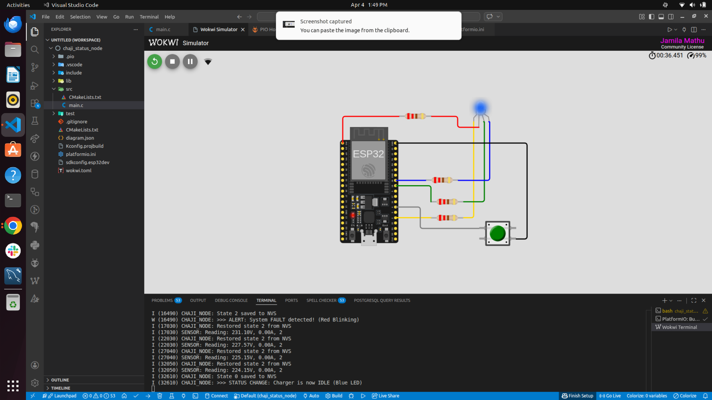
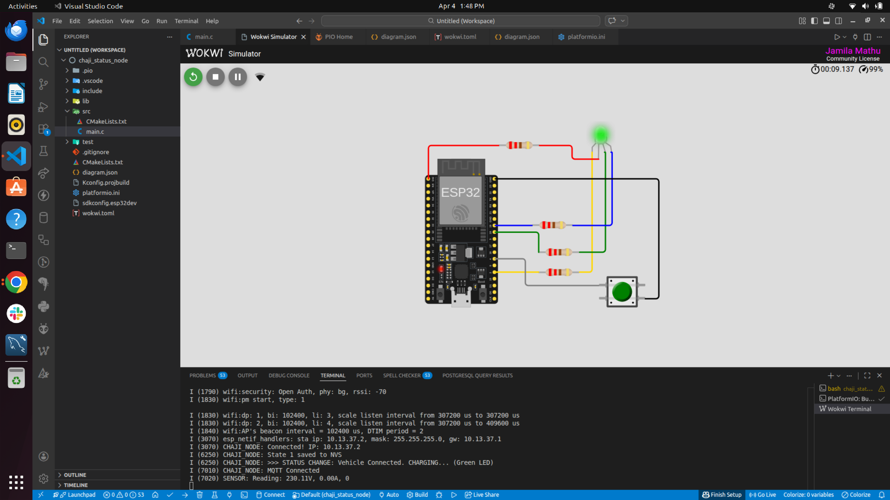
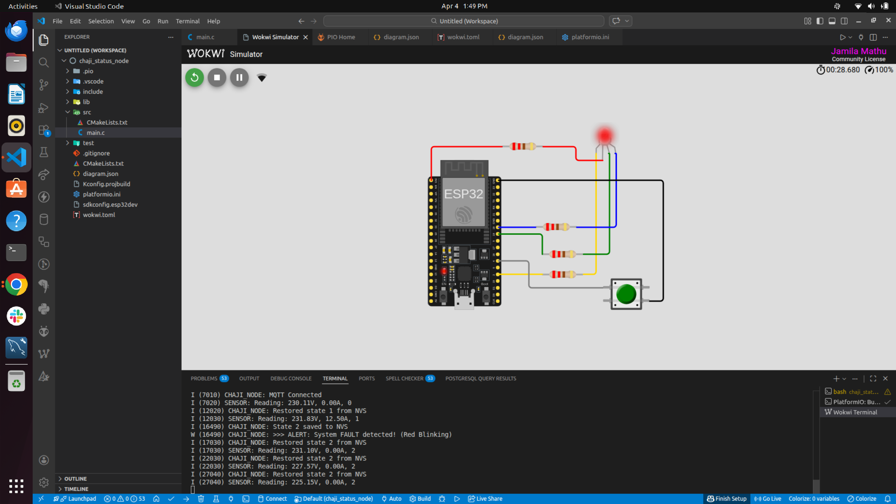
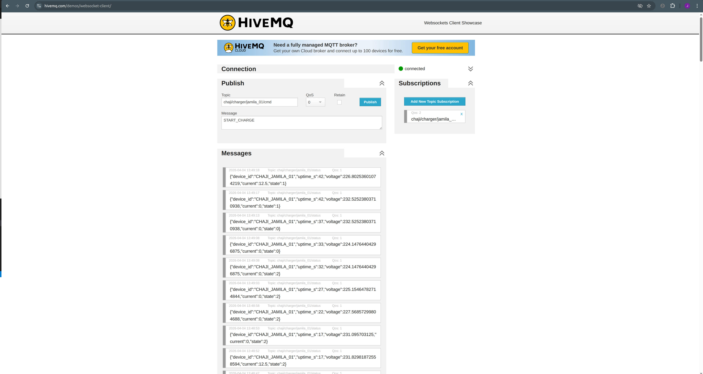

# CHAJI Charge-Point Status Reporter (Task 01)

**Author:** Jamila  
**Date:** April 2026  

## Overview
This project implements a minimal ESP32-based charge-point status node using ESP-IDF (v5.x) and C.

It publishes telemetry over MQTT and listens for remote commands to control charging state. The system is built using FreeRTOS with clear separation between networking and application logic.

---

## How to Run

### Local Build (Recommended)
1. Install ESP-IDF or use PlatformIO in VS Code  
2. Clone this repository  
3. Configure Wi-Fi + MQTT settings (see Configuration section)  
4. Build and flash:

```bash
idf.py build
idf.py flash monitor
```

## Simulation
A Wokwi simulation is included for quick testing without hardware. 
I used this during development to validate task interaction, LED behaviour, and MQTT messaging without needing to stub ESP-IDF networking.It:
1. Simulates ESP32 + RGB LED
2. Connects to public MQTT broker
3. Demonstrates state transitions and telemetry

## Configuration
Note: As this project was developed using PlatformIO, the configuration options are managed directly as build flags in platformio.ini to ensure reproducibility across different developer machines.

| Parameter         | Description        | Default Values            |
|-------------------|--------------------|---------------------------|
| WIFI_SSID         | Wi-Fi network      | Wokwi-GUEST               |
| WIFI_PASS         | Wi-Fi password     | (empty)                   |
| MQTT_BROKER_URI   | Broker URL         | mqtt://broker.hivemq.com  |
| DEVICE_ID         | Device identifier  | CHAJI_JAMILA_01           |

---

## MQTT Topics

| Direction| Topic                                    | Payload Format  | Description                                                             |
|----------|------------------------------------------| --------------  | ----------------------------------------------------------------------- |
| Publish  | chaji/charger/<device_id>/status         | JSON            | Telemetry sent every 5 seconds or instantly on button press.            |
| Subscribe| chaji/charger/<device_id>/cmd            | Text            | Listens for remote commands. Valid payloads: START_CHARGE, STOP_CHARGE. |

---

## Commands

- `START_CHARGE`
- `STOP_CHARGE`

---

## System Behaviour

### States → LED Output

- **IDLE** → Blue  
- **CHARGING** → Green  
- **FAULT** → Red (2 Hz blink)

---

## Telemetry (every 5s)

- `device_id`
- `uptime_s`
- `voltage_V` (simulated)
- `current_A` (simulated)
- `charge_state`

---

## Design Notes

**Task separation**
- MQTT handling and system logic run in separate FreeRTOS tasks to keep responsibilities clear and avoid blocking.

**State communication**
- State updates are passed via FreeRTOS queues instead of shared globals.

**Persistence (NVS)**
- The last known charge state is stored and restored on reboot.

**LED timing**
- The FAULT state uses esp_timer for a precise 2 Hz blink without blocking the scheduler.

**Immediate updates**
- State changes trigger an instant MQTT publish instead of waiting for the 5-second interval.

---

## Assumptions

- Sensor values are simulated
- Wi-Fi connection succeeds in simulation
- No physical hardware required

---

## Evidence

- MQTT messages visible on public broker (HiveMQ)
- Wokwi simulation demonstrates LED behaviour and state changes


## Screenshots
### 1. IDLE State
*Triggered on boot (if saved in NVS) or via `STOP_CHARGE` command.*



### 2. CHARGING State
*Triggered via physical button press or `START_CHARGE` command.*



### 3. FAULT State
*Triggered via physical button press. LED blinks at 2Hz.*



### 4. Cloud Telemetry Verification
*Real-time JSON payloads arriving at the HiveMQ broker.*




## Transparency
AI tools were used for debugging specific implementation details (e.g. MQTT callbacks and FreeRTOS usage). All system design and integration decisions were made and verified independently.


